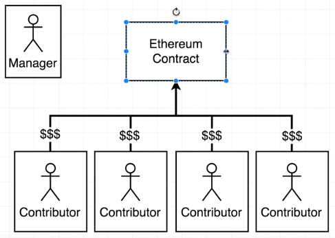
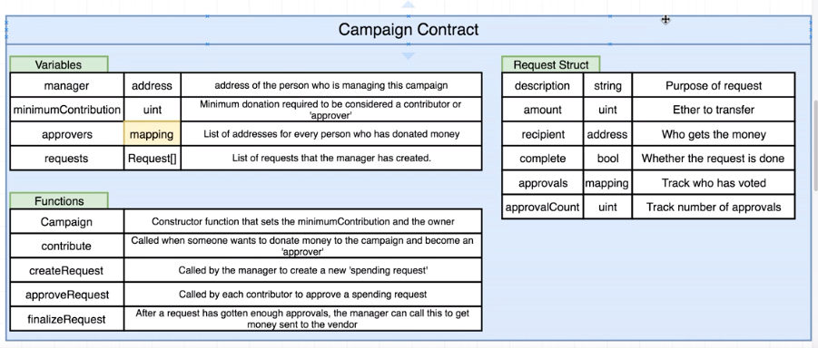
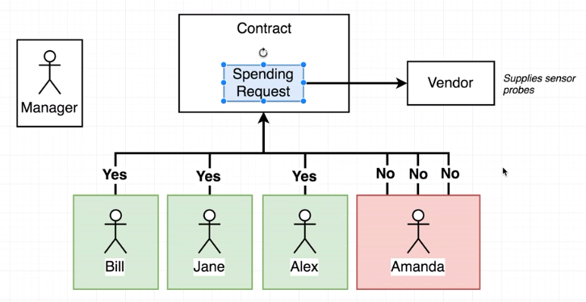
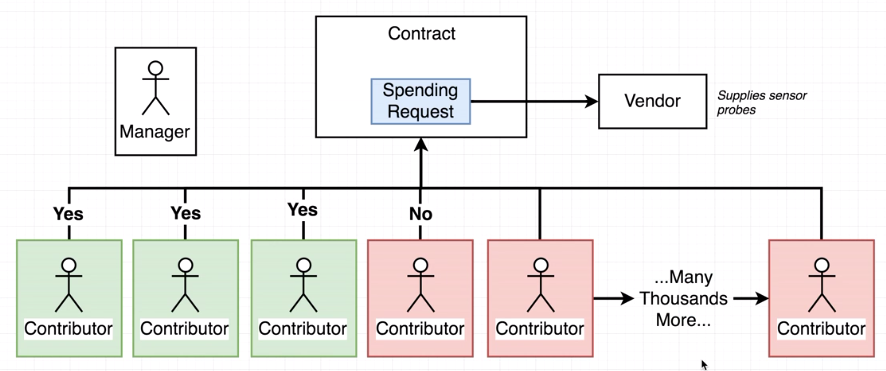
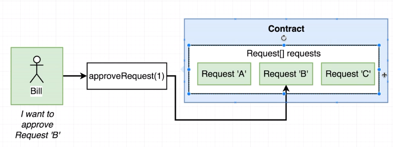
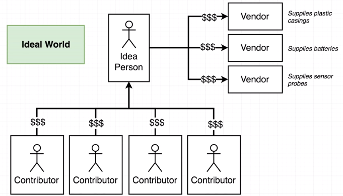
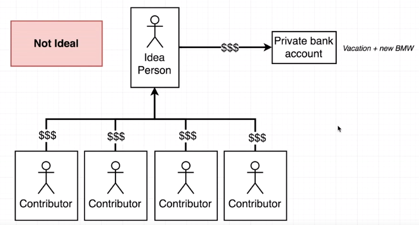

# Crowd Funding Campaign on Ethereum

## Workflow
Manager setups a contract for fund raising.
Contributors put $$$ into the contract as contributor.
Each contributor becomes approver of each spending to vendor.
For each request of money spent, it requires voting support from approvers.

## Contract

## Voting Rule 1 - Single vote per request from each approver
For each spending request, No multiple vote by a single person

## Voting Rule 2 - Resilient for large number of approvers
Expect thousands of approvers in voting  
System resilient for thousands of approvers

## Approval of request

## Today Crowd Funding such as KickStarter
### Ideal case

### Real World
Capital being spent without control. 
Lack of transparency to stakeholder of monitoring delivery. 
No control if spending outside of project. 

