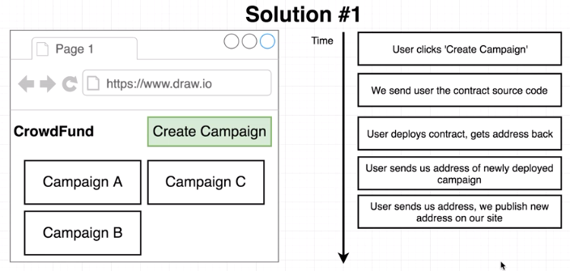
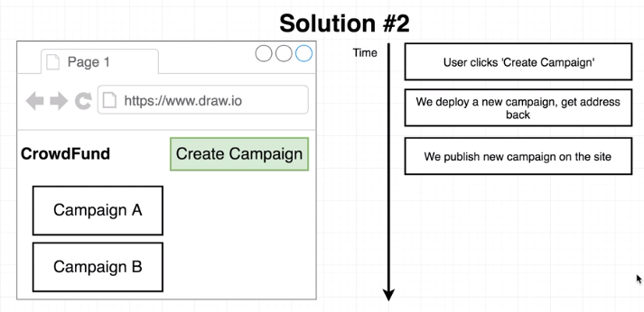

# Crowd Funding Campaign on Ethereum

## Workflow
Manager setups a contract for fund raising.
Contributors put $$$ into the contract as contributor.
Each contributor becomes approver of each spending to vendor.
For each request of money spent, it requires voting support from approvers.

## Contract

## Voting Rule 1 - Single vote per request from each approver
For each spending request, No multiple vote by a single person

## Voting Rule 2 - Resilient for large number of approvers
Expect thousands of approvers in voting  
System resilient for thousands of approvers

## Approval of request

## Deployment of campaign

### Target Architecture
A factory contract to allow 
1) User cannot modify our campaign contract to address security concern 
2) User pay the deployment of the contracts 

Factory contract to manage campaign contract 

Factory Contract 

### Concern allowing user to deploy their own contract instead our service
User gets the source code of the contract and deploy it into nework on their own. 
Concern: 
1) Before deployment themselves, users can modify the contract and insert backdoor => lead to security flaw 
2) Our service is difficult to validate the address of the contract (dependency on user to provide the deployed address back to service) 
  
Security flaw illustrated as below  

### Concern our service to deploy contract on behalf of users
Our service helps user to deploy the contract.  
Concern:  
Our service pays gas to deploy the contract 
=> More complexity on system workflow to charge gas payment back to users. 

## Today Crowd Funding such as KickStarter
### Ideal case

### Real World
Capital being spent without control. 
Lack of transparency to stakeholder of monitoring delivery. 
No control if spending outside of project. 

