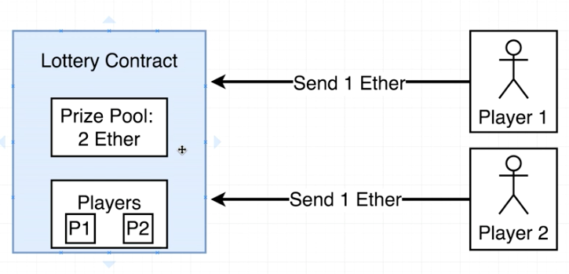
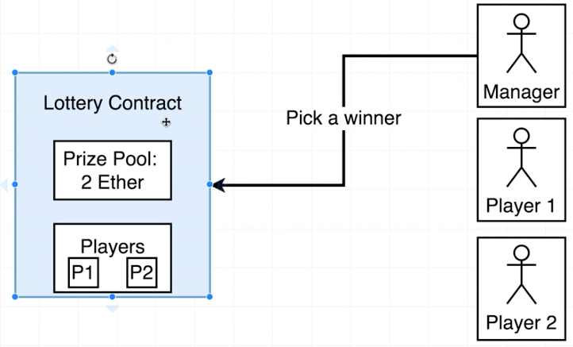
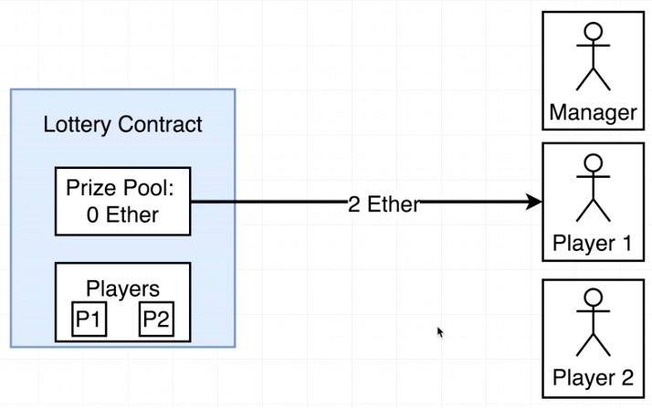
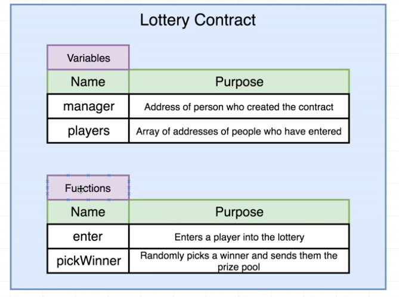
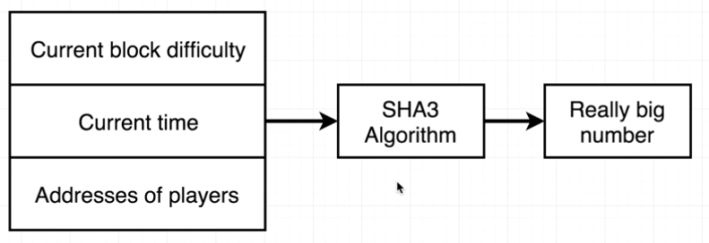
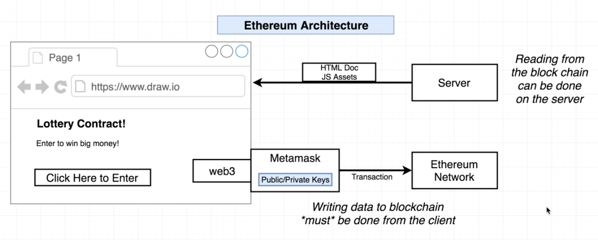
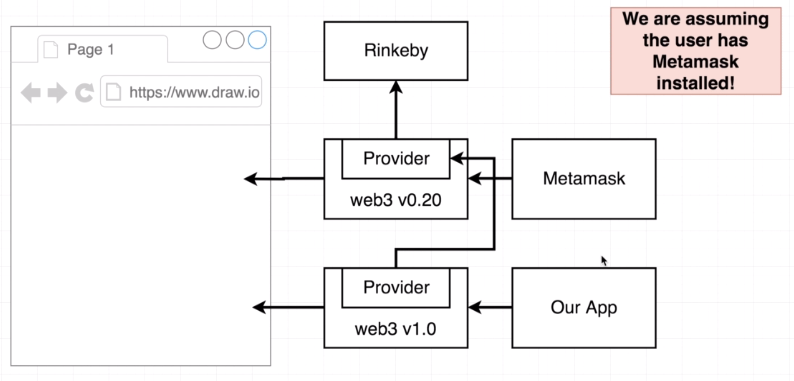
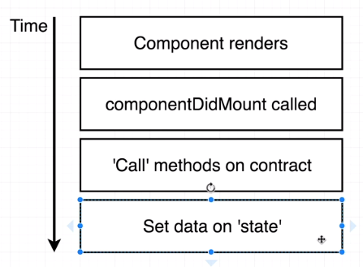

# Lottery use case
A use case of Lottery on Ethereum blockchan

# Compile Solidity Contract
Run:
node compile.js

#Run the test case
Run:
npm run test  
test script is connecting to local node emulated by ganache

# Lottery Contract - place bet
Initially, player sends eth to the pool 
 
# Lottery Contract - choose winner
Manager chose a winner 
 
# Lottery Contract - return the reward 
 

# Lottery Contract function overview  
 

# Pseudo Random Generator  
 

# Ethereum Web App Architecture

# Ethereum Dapp with metamask
Every page of your browser is injected with web3 V0.2 provider with metamask.  
That web3 instance with Metamask was ready to connect to Rinkeby network. 
Our Dapp is using web3V1.0.  
However, metamask web3 stores all private keys inside the provider. 
Therefore, Dapp web3 tap on metamask web3. 

# Ethereum Front-end events - render the contract info lifecycle
